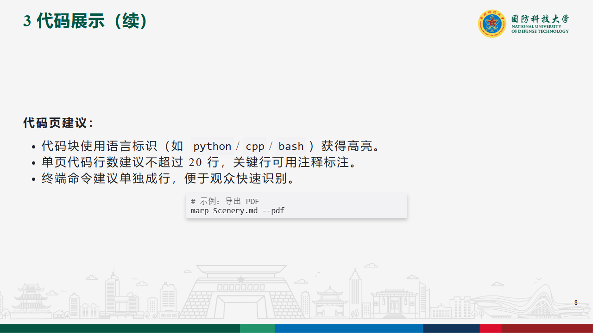

# Marp-Theme-NUDT

国防科技大学风格的 Marp 幻灯片主题与示例文稿。

## 项目说明

- 主题文件位于 `themes/`，当前主要示例使用 `NUDTSce` 主题。
- 示例文稿为 `Scenery.md`，可直接在 Cursor / VSCode + Marp 插件中预览与导出。
- 导出文件位于 `doc/`：包含 `Scenery.pdf` 与逐页 PNG。

## 目录结构

```bash
Marp-Theme-NUDT-master
  |__ .vscode
  |     |__ settings.json
  |__ doc
  |     |__ Scenery
  |     |     |__ Scenery.001.png
  |     |     |__ ...
  |     |__ Scenery.pdf
  |__ images
  |__ themes
  |     |__ NUDTSce.css
  |     |__ NUDTSimple.css
  |__ Scenery.md
  |__ README.md
  |__ LICENSE
```

## 使用方式

1. 安装 Marp for VS Code（Cursor 同样适用）。
2. 打开 `Scenery.md`，在右侧预览效果。
3. 导出 PDF：命令面板执行 `Marp: Export slide deck...` 并选择 PDF。

## 命令行导出（可选）

```bash
npx @marp-team/marp-cli "Scenery.md" --pdf --no-stdin --allow-local-files --theme-set "themes/NUDTSce.css" -o "doc/Scenery.pdf"
npx @marp-team/marp-cli "Scenery.md" --images png --no-stdin --allow-local-files --theme-set "themes/NUDTSce.css" -o "doc/Scenery/Scenery.png"
```

## 示例页预览




